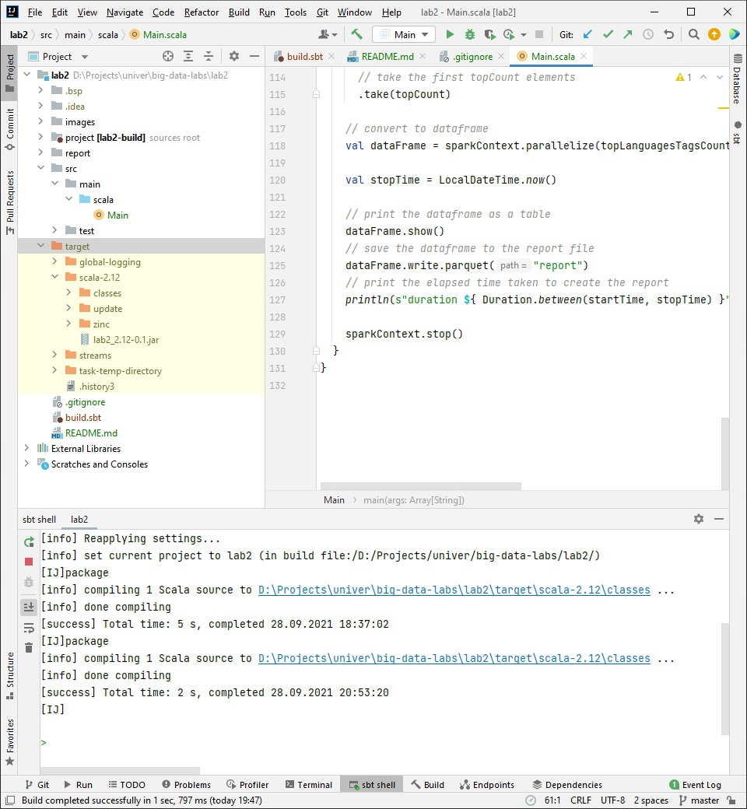
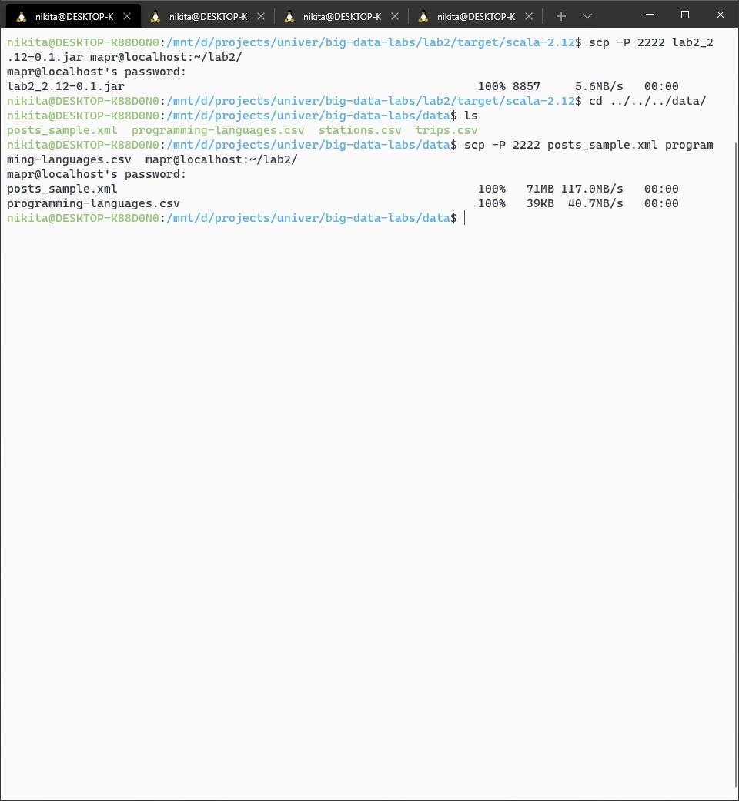
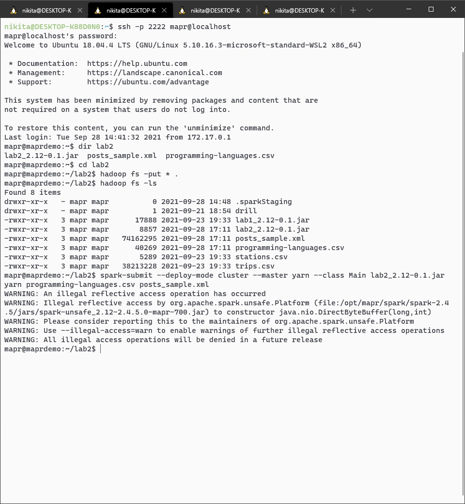
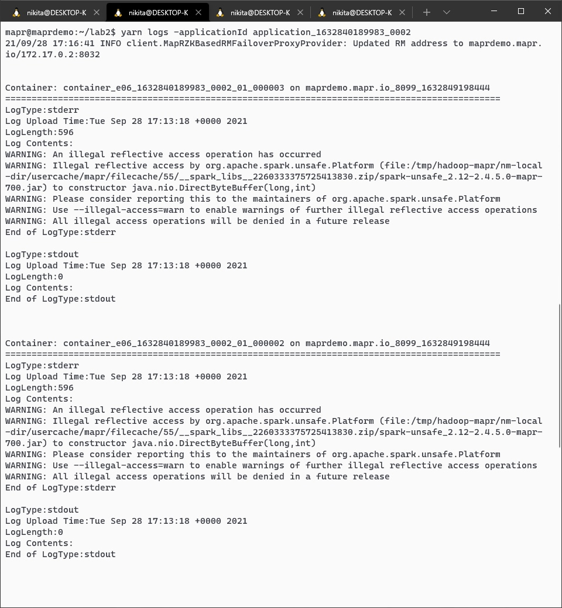
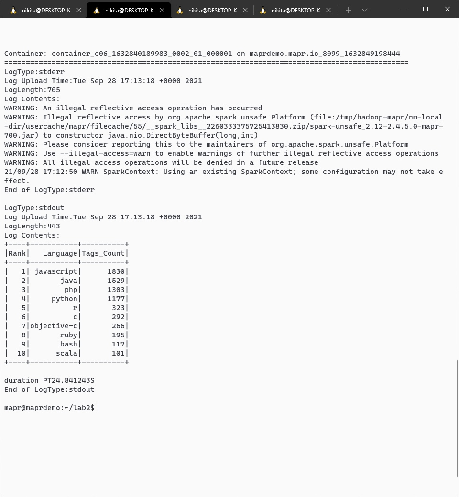
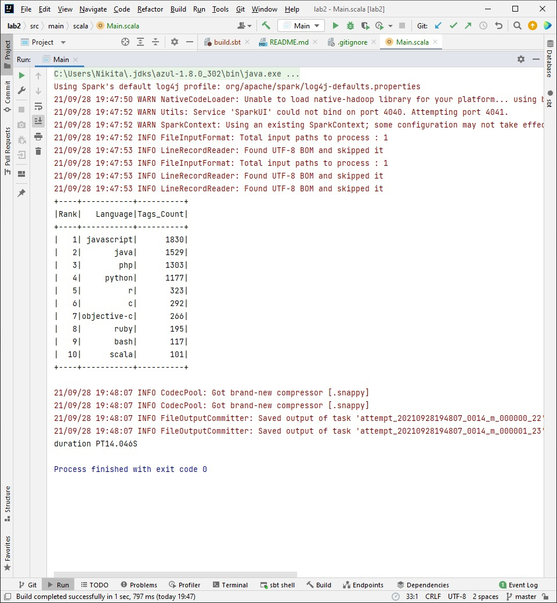
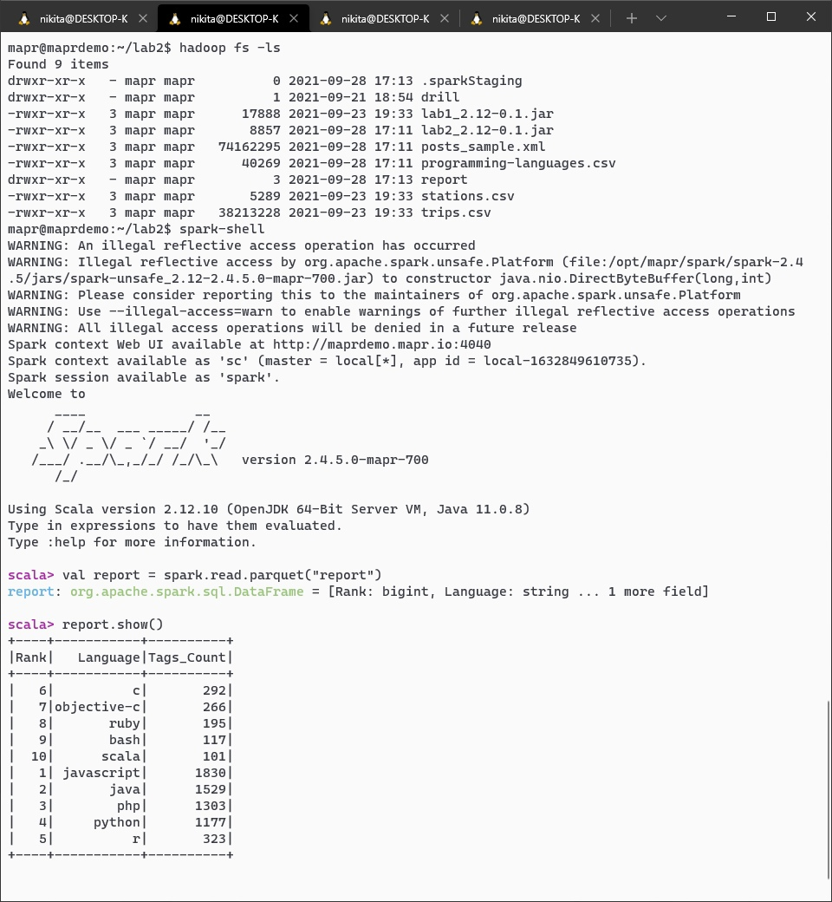
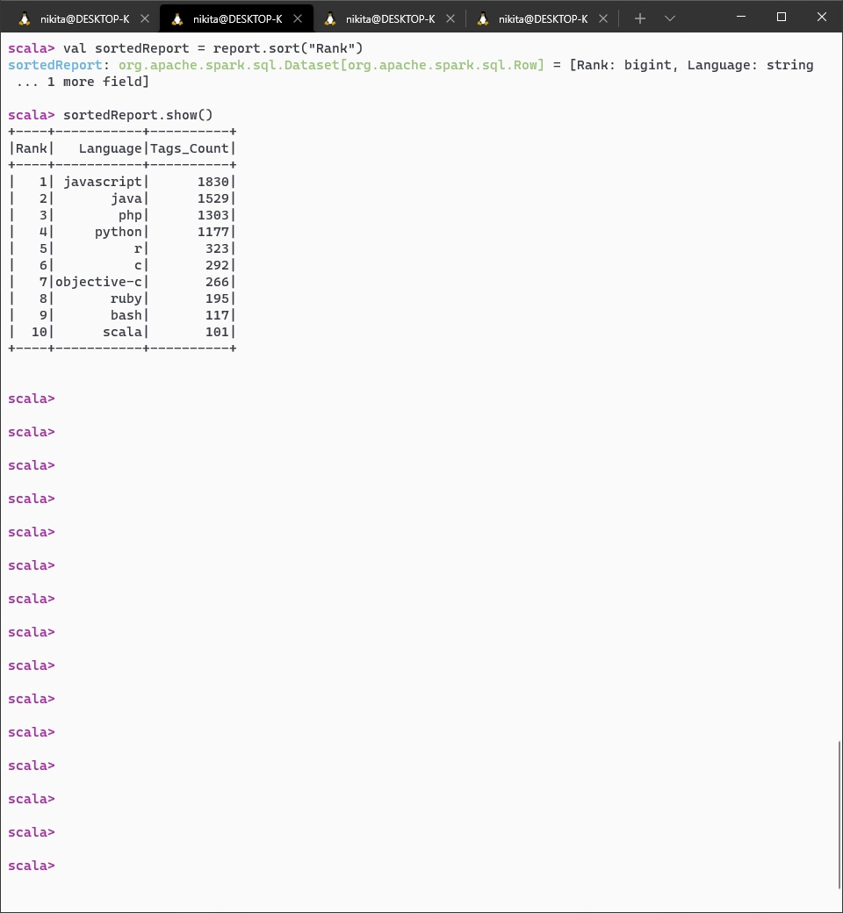

# Lab #2 - Reports with Apache Spark - for Big Data course
- Scala 2.12.9
- sbt 1.5.5
- JDK 1.8.0_302 (local)
- JDK 11.0.8 (server)
- Apache Spark 2.4.5

Задание https://gitlab.com/ssau.tk.courses/big_data/-/tree/master/L2%20-%20Reports%20with%20Apache%20Spark.

При выполнении данной работы был использован тот же самый кластер, что и в [предыдущей работе](../lab1).


Программа была написана и отлажена на языке Scala в среде разработки Intellij IDEA с 
использованием системы автоматической сборки sbt. Был создан jar-файл проекта с помощью команды package:



Затем собранный jar-файл и файлы с данными были скопированы из локальной файловой системы в контейнер по 
протоколу SSH с помощью команд, как изображено на рисунке:



Было произведено подключение к контейнеру, затем полученные файлы были размещены в системе HDFS, 
и jar-файл был развёрнут на Spark-кластере следующим образом:



С помощью следующей команды был получен номер развёрнутой на кластере программы:

```shell
yarn application -list -appStates ALL
```
Были получены следующие логи программы:




Таким образом, можно сделать вывод, что выдача программы на сервере идентична выдаче в IDE при запуске 
на локальном компьютере:


С помощью утилиты spark-shell было получено содержимое Apache Parquet-файла с отчётом, составленным разработанной 
программой:


Таким образом, можно сделать вывод, что Spark SQL так же, как и обычный SQL, не гарантирует порядок строк и столбцов,
что подтверждается документацией: https://spark.apache.org/docs/latest/sql-data-sources-parquet.html.

Чтобы получить отчёт в нужном виде, можно воспользоваться, например, методом sort:



