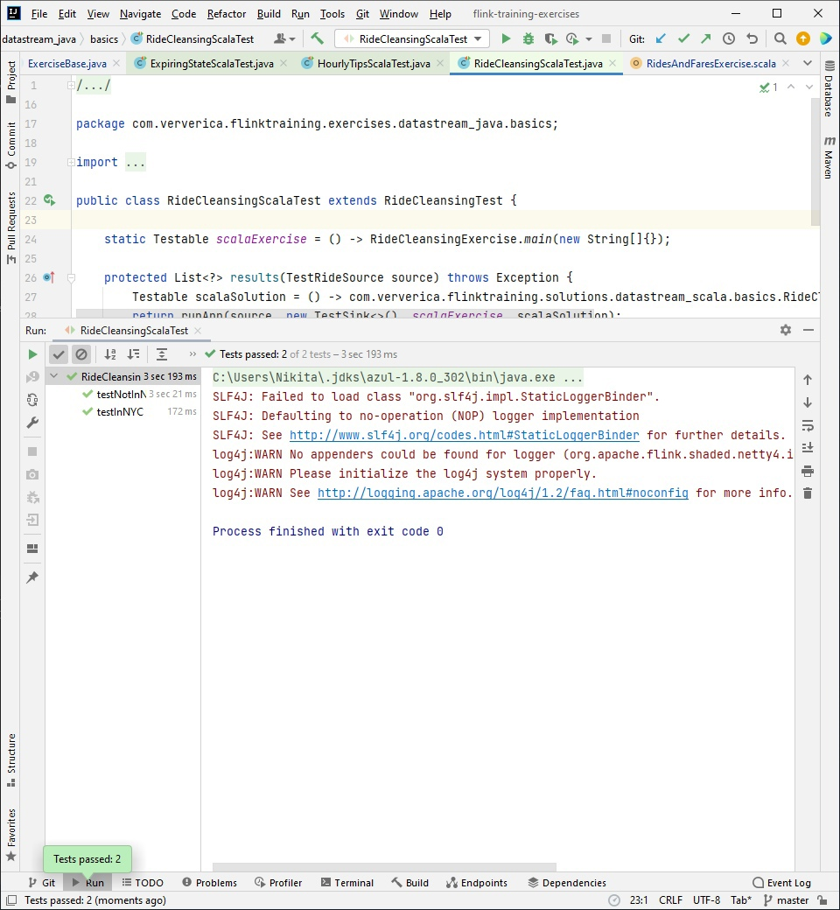
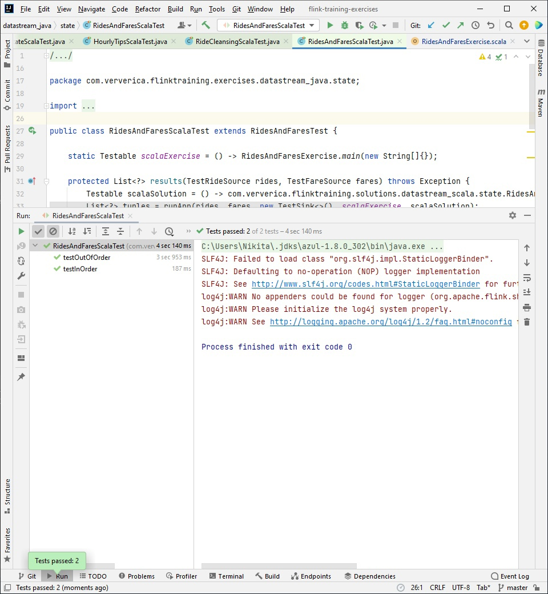
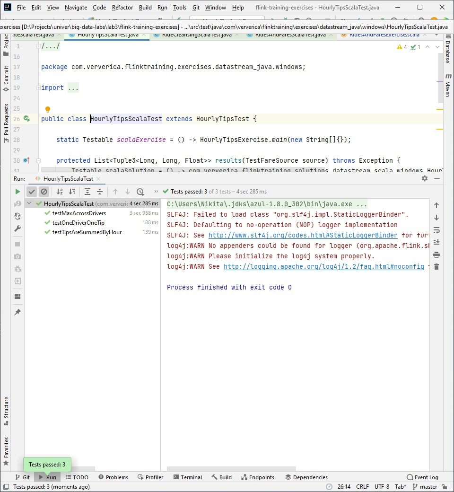
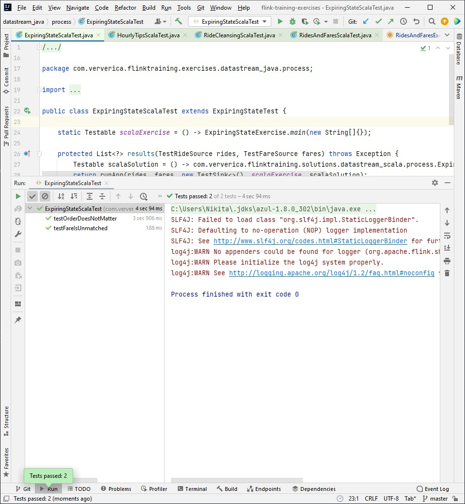

# Lab #3 - Stream processing with Apache Flink - for Big Data course
- Scala 2.12.9
- JDK 1.8.0_302 (local)
Задание https://gitlab.com/ssau.tk.courses/big_data/-/tree/master/L3%20-%20Stream%20processing%20with%20Apache%20Flink.

## Решения 
Задания были выполнены на языке Scala.
Перед выполнением заданий были указаны пути к данным в файле
[ExerciseBase.java](flink-training-exercises/src/main/java/com/ververica/flinktraining/exercises/datastream_java/utils/ExerciseBase.java):
```java
	public final static String pathToRideData = "../../data/nycTaxiRides.gz";
	public final static String pathToFareData = "../../data/nycTaxiFares.gz";
```
### RideCleanisingExercise
В [файл с заданием](flink-training-exercises/src/main/scala/com/ververica/flinktraining/exercises/datastream_scala/basics/RideCleansingExercise.scala)
было добавлено следующее решение:

```scala
    // geographical boundaries coordinates of the area of NYC
    val lon_east = -73.7
    val lon_west = -74.05
    val lat_north = 41.0
    val lat_south = 40.5

    def isInNYC(lon: Float, lat: Float) = !(lon > lon_east || lon < lon_west) && !(lat > lat_north || lat < lat_south)

    val filteredRides = rides
      // filter out rides that do not start and end in NYC
      .filter(ride => isInNYC(ride.startLon, ride.startLat) && isInNYC(ride.endLon, ride.endLat))
```
### RidesAndFaresExercise
В [файл с заданием](flink-training-exercises/src/main/scala/com/ververica/flinktraining/exercises/datastream_scala/state/RidesAndFaresExercise.scala)
было добавлено следующее решение:

```scala
  class EnrichmentFunction extends RichCoFlatMapFunction[TaxiRide, TaxiFare, (TaxiRide, TaxiFare)] {
    // current value state from the connected stream of rides
    lazy val rideState: ValueState[TaxiRide] = getRuntimeContext.getState(
      new ValueStateDescriptor[TaxiRide]("ride", classOf[TaxiRide]))
    // current value state from the connected stream of fares
    lazy val fareState: ValueState[TaxiFare] = getRuntimeContext.getState(
      new ValueStateDescriptor[TaxiFare]("fare", classOf[TaxiFare]))

    // called for each element in the connected stream of rides
    override def flatMap1(ride: TaxiRide, out: Collector[(TaxiRide, TaxiFare)]): Unit = {
      val fare = fareState.value
      // skip null fares
      if (fare != null) {
        out.collect((ride, fare))
        fareState.clear()
      }
      else {
        rideState.update(ride)
      }
    }

    // called for each element in the connected stream of fares
    override def flatMap2(fare: TaxiFare, out: Collector[(TaxiRide, TaxiFare)]): Unit = {
      val ride = rideState.value
      // skip null rides
      if (ride != null) {
        out.collect((ride, fare))
        rideState.clear()
      }
      else {
        fareState.update(fare)
      }
    }

  }
```
### HourlyTipsExerxise
В [файле с заданием](flink-training-exercises/src/main/scala/com/ververica/flinktraining/exercises/datastream_scala/windows/HourlyTipsExercise.scala)
был написан класс:

```scala
  class WrapWithWindowInfo() extends ProcessWindowFunction[(Long, Float), (Long, Long, Float), Long, TimeWindow] {
    override def process(key: Long, context: Context, elements: Iterable[(Long, Float)], out: Collector[(Long, Long, Float)]): Unit = {
      val sumOfTips = elements.iterator.next()._2
      out.collect((context.window.getEnd, key, sumOfTips))
    }
  }
```
В метод main был добавлен следующий код решения:

```scala
    // max tip total in each hour
    val hourlyMax = fares
      .map(fare => (fare.driverId, fare.tip))
      // key by driver id
      .keyBy(_._1)
      // convert to window stream
      .timeWindow(Time.hours(1))
      .reduce(
        // calculate total tips
        (f1, f2) => {
          (f1._1, f1._2 + f2._2)
        },
        new WrapWithWindowInfo()
      )
      .timeWindowAll(Time.hours(1))
      .maxBy(2)
    
    // print result on stdout
    printOrTest(hourlyMax)
    
    // execute the transformation pipeline
    env.execute("Hourly Tips (scala)")
```
### ExpiringStateExercise
В [файле с заданием](flink-training-exercises/src/main/scala/com/ververica/flinktraining/exercises/datastream_scala/process/ExpiringStateExercise.scala)
был реализован следующий класс:

```scala
  class EnrichmentFunction extends KeyedCoProcessFunction[Long, TaxiRide, TaxiFare, (TaxiRide, TaxiFare)] {
    // current value state from the connected stream of rides
    lazy val rideState: ValueState[TaxiRide] = getRuntimeContext.getState(
      new ValueStateDescriptor[TaxiRide]("ride", classOf[TaxiRide]))
    // current value state from the connected stream of fares
    lazy val fareState: ValueState[TaxiFare] = getRuntimeContext.getState(
      new ValueStateDescriptor[TaxiFare]("fare", classOf[TaxiFare]))

    // called for each element in the connected stream of rides
    override def processElement1(ride: TaxiRide,
                                 context: KeyedCoProcessFunction[Long, TaxiRide, TaxiFare, (TaxiRide, TaxiFare)]#Context,
                                 out: Collector[(TaxiRide, TaxiFare)]): Unit = {
      val fare = fareState.value
      // skip null fares
      if (fare != null) {
        context.timerService.deleteEventTimeTimer(ride.getEventTime)
        out.collect((ride, fare))
        fareState.clear()
      }
      else {
        rideState.update(ride)
        context.timerService.registerEventTimeTimer(ride.getEventTime)
      }
    }

    // called for each element in the connected stream of fares
    override def processElement2(fare: TaxiFare,
                                 context: KeyedCoProcessFunction[Long, TaxiRide, TaxiFare, (TaxiRide, TaxiFare)]#Context,
                                 out: Collector[(TaxiRide, TaxiFare)]): Unit = {
      val ride = rideState.value
      // skip null rides
      if (ride != null) {
        context.timerService.deleteEventTimeTimer(ride.getEventTime)
        out.collect((ride, fare))
        rideState.clear()
      }
      else {
        fareState.update(fare)
        context.timerService.registerEventTimeTimer(fare.getEventTime)
      }
    }

    // Called when a timer set using TimerService fires
    override def onTimer(timestamp: Long,
                         ctx: KeyedCoProcessFunction[Long, TaxiRide, TaxiFare, (TaxiRide, TaxiFare)]#OnTimerContext,
                         out: Collector[(TaxiRide, TaxiFare)]): Unit = {
      if (fareState.value != null) {
        ctx.output(unmatchedFares, fareState.value)
        fareState.clear()
      }
      if (rideState.value != null) {
        ctx.output(unmatchedRides, rideState.value)
        rideState.clear()
      }
    }
  }
```
## Тесты
Были запущены тесты реализованных решений:






Таким образом, все задания выполнены.
