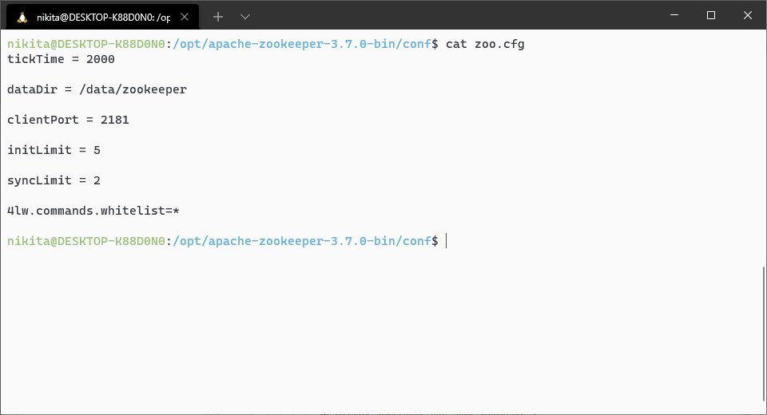
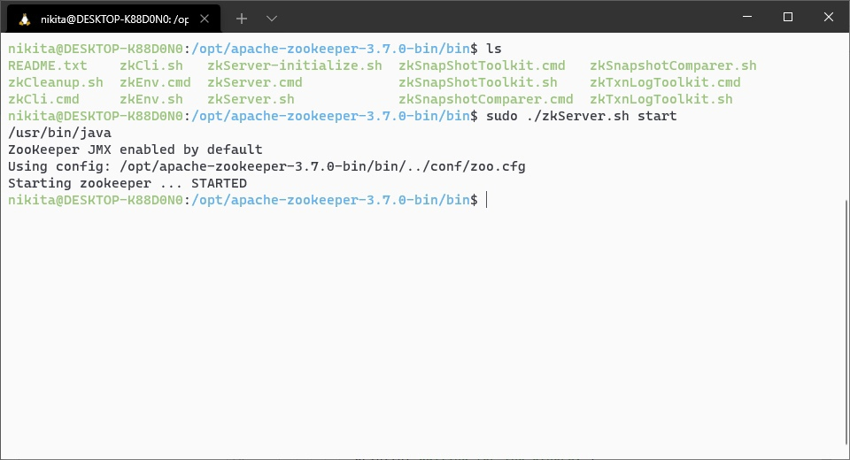
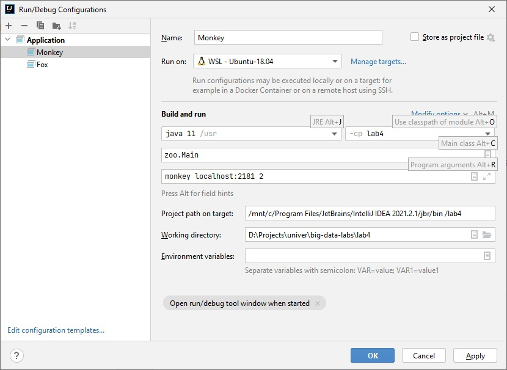
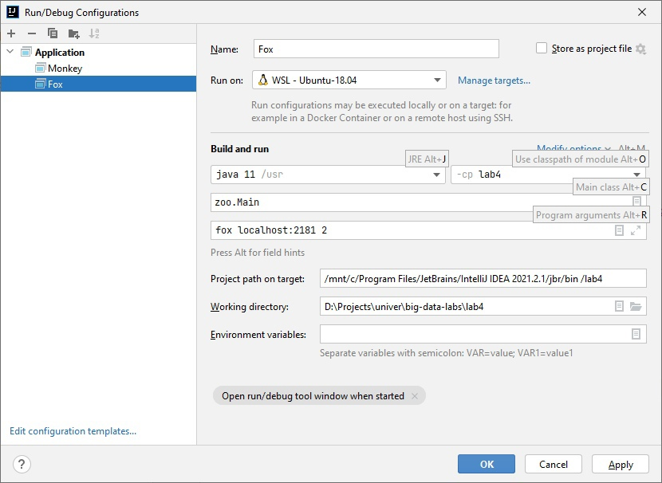
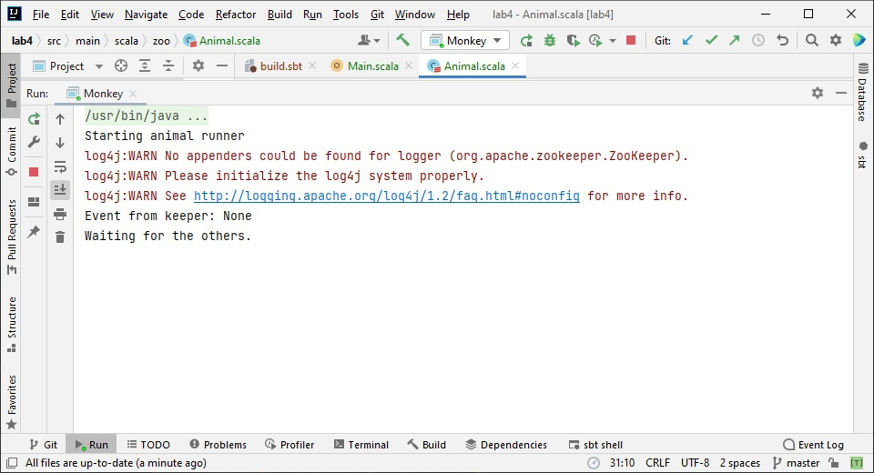
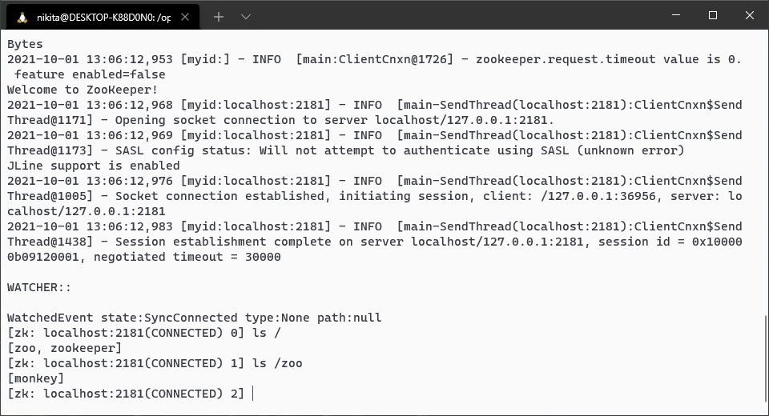
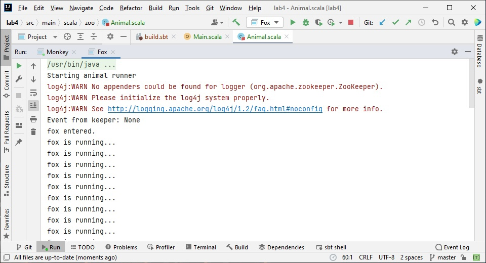
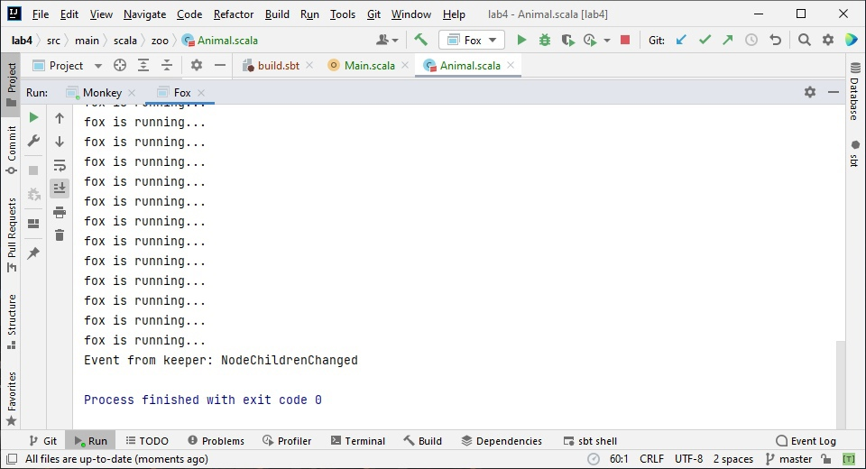
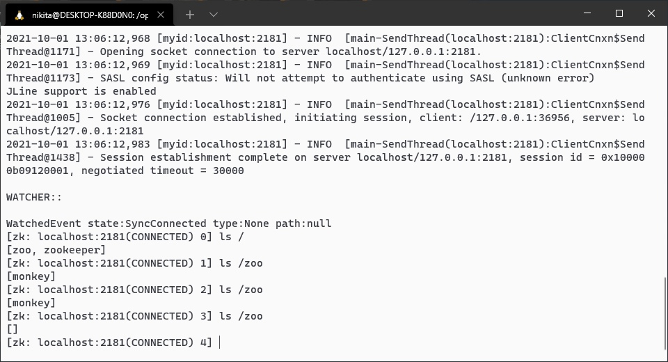

# Lab #4 - ZooKeeper - for Big Data course
- Scala 2.12.9
- JDK 1.8.0_302 
- Apache ZooKeeper 3.7.0
- WSL Ubuntu 18.04

## Задание 
https://gitlab.com/ssau.tk.courses/big_data/-/blob/master/L4%20-%20ZooKeeper/L4_Zookeeper.md

## Решение 
Был установлен ZooKeeper и создан конфигурационный файл:

Был запущен ZooKeeper-сервер:

Были реализованы классы Animal и Main и добавлены следующие конфигурации запуска:

Была запущена программа с конфигурацией Monkey:

В результате этого запуска на сервере появился узел monkey:

Затем была запущена программа с конфигурацией Fox:

Таким образом, так как количество узлов достигло 2, узел fox был удалён по 
завершении цикла.

После остановки программы все узлы были автоматически удалены:

